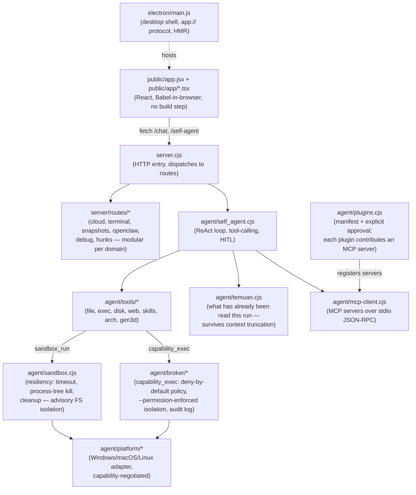

# 🐺 WOLFSPACE

**A local, open-source AI coding agent that works on your files and runs what it writes.**

[**wolfspace site**](https://tegardave-alt.github.io/Wolfspace-ai-native/) — overview and
download links. The app itself runs on your machine, not on the web.

WOLFSPACE treats the model as an **untrusted guesser**: it reads, greps, and edits your
source through tools, and when it needs to know whether something works, it runs a command
and reads the real output — under a policy that can deny the call and an audit trail that
records it.

> **model proposes → a tool runs it → real stdout/stderr comes back**

### What changed, and why this section is worded carefully

Earlier versions of this README promised something stronger: that **every** code answer was
executed automatically, and that the agent _"cannot even declare itself done without a
successful execution to point at."_ That auto-run pipeline has been removed — it had already
stopped working long before it was deleted:

- the `/run` endpoint did not exist; the UI's Run button POSTed to it and got the HTML index
  page back, then failed on `r.json()` with _"Server unreachable"_
- `runReply()` returned `{ok: true, info: "auto-run disabled in normal chat"}` without
  executing anything, and that `ok: true` was emitted to the UI as if it were a verdict
- the nine-language dispatcher (`runByLang`) had **zero callers** in either of the two copies
  it existed in

About 1,100 lines of it are gone. Verification today is real but **agent-driven**: it happens
when the agent chooses to run something, not automatically on every answer.

---

## Features

- ✅ **Runs what it writes.** The agent executes commands through `sandbox_run` (crash
  isolation, process-tree-killing timeout) and `capability_exec` (deny-by-default broker,
  audited) and reads the real stdout/stderr back. Execution is a step the agent takes, not
  an automatic pass over every reply.
- 🔌 **Any cloud model.** Bring your own API key — the provider is auto-detected from the key
  (OpenAI, Claude, Gemini, Groq, OpenRouter, GitHub Models, NVIDIA, DeepSeek, Qwen,
  OpenCode, or any OpenAI-compatible endpoint).
- ✏️ **Real editor.** Monaco (VS Code's editor) for every code block — edit in place or ask
  the AI to revise.
- 🔗 **MCP tools.** Connect Model Context Protocol servers (Notion, GitHub, filesystem, …);
  their tools become callable by the agent, with live per-server connection status.
  The client speaks **stdio** JSON-RPC; Streamable-HTTP and legacy-SSE servers are
  reached through `scripts/mcp-http-bridge.cjs`.
- 🧩 **Plugins.** Install a plugin and it contributes an MCP server of its own, declaring
  the permissions it wants in a manifest. Nothing is granted until you approve it, and
  revoking approval closes the gate again — a plugin can only ever narrow what it was
  granted, never widen it.
- 🕸️ **Logic canvas.** A React Flow node graph for composing multi-step workflows from
  Trigger, HTTP Request, Transform, Condition, and Output nodes, wired together visually.
- 🌐 **Web fetch with a real browser.** `webExtract` drives Playwright for pages that only
  assemble their content after scripts run, so the agent reads what a browser would see
  rather than the empty shell the server sends. Outbound URLs pass an SSRF check that
  resolves DNS first, so a hostname cannot smuggle in a private address.
- 🔒 **Local-first.** Runs on your machine, with your keys. Nothing leaves your computer
  except the model API calls you opt into.
- 🤖 **Self-editing agent.** WOLFSPACE ships an agent that can read, grep, and edit
  WOLFSPACE's _own_ source under a snapshot → syntax-check → apply-or-rollback discipline.

---

## Quickstart

```bash
git clone https://github.com/tegardave-alt/Wolfspace-ai-native
cd Wolfspace-ai-native
npm install
npm run app                    # <- this is how you run WOLFSPACE
```

`npm run app` launches the desktop shell: Electron opens a native window and the backend
runs **in-process** inside it. That is the supported way to run WOLFSPACE, and the one the
rest of this README assumes.

Paste any **cloud API key** in settings, then give the agent a task. It edits files and runs
commands, and you see the real output.

> **On Windows PowerShell, use `npm.cmd run app` (or `node scripts/app.cjs`).**
> PowerShell resolves `npm` to `npm.ps1` before `npm.cmd`, and the default execution policy
> (`Restricted`) blocks `.ps1` — so a bare `npm run app` fails with a policy error while
> `npm.cmd run app` works. Calling `node` directly avoids the shim entirely and behaves the
> same in every shell.

**Requirements:** [Node.js](https://nodejs.org) 18+. Python is optional (the agent uses it if
your task does). No build step — the UI is served as-is.

### `npm start`: server only, no window

```bash
npm start                      # -> http://127.0.0.1:8090
```

This starts the same backend as a plain HTTP server and serves the UI in your browser. It is
useful for headless machines, remote access over SSH tunnels, and debugging with browser
devtools — but it is **not** the primary path, and a few things differ:

- no native window, no `app://` protocol, no Electron IPC (the UI falls back to `fetch`)
- the JS runtime for executed code is `node.exe` rather than `electron.exe`, so the two modes
  do not exercise the same code path (see the `ELECTRON_RUN_AS_NODE` note in **Roadmap**
  history — that bug only ever appeared under `npm run app`)

Bun is not a supported runtime. Nothing detects or configures it: the JS runtime is simply
whatever launched the server (`process.execPath`), so launching with Bun happens to work
rather than being supported.

### WSL variant

`npm run app:wsl` runs the backend inside WSL, which is the only place the agent sandbox's
network containment actually applies (Node's permission model has no network dimension, and
Windows firewall rules are per-executable — the zone is the same `node.exe` as the host).
Filesystem containment works on both. See `agent/broker/README.md`.

### Building the installer

```bash
npm run dist                   # electron-builder --win -> dist-app/
```

Produces an NSIS installer plus an unpacked build under `dist-app/win-unpacked/`. The
packaged app's Electron entry point is rewritten by `build.extraMetadata.main` to
`electron/main.js` — `package.json`'s own `main` field says `server.cjs`, which is correct
for `npm start` but would be wrong for the packaged app.

The installer is **not code-signed**, so Windows SmartScreen will warn on first run —
choose _More info → Run anyway_.

### Container / hosted

Removed. The `Dockerfile`, `.dockerignore`, `config.docker.json`, and `sandbox/`
image are gone — nothing in the app shelled out to `docker` anymore, so the files
only described a deployment path that was no longer exercised. Containment now
comes from Node `--permission` (capability zone), Linux namespaces
(`agent/tools/bash-jail.cjs`), and the WSL zone — none of which need a daemon.

### Local models: not currently wired

> **A cloud API key is required.** The llama.cpp path is **not connected**, and the client
> code for it is now gone: `askModelStream()` lived in `agent/runners.cjs`, which was deleted
> along with the rest of the unused execution stack. A running `llama-server` is never used
> even if `/models` reports it. The setup scripts below are kept because they still fetch and
> launch llama.cpp correctly, but reconnecting local models now means **writing a new client**,
> not restoring a call.

Local models use [llama.cpp](https://github.com/ggml-org/llama.cpp). One-time setup downloads
`llama-server` + a small CPU-friendly model:

```powershell
powershell scripts/setup.ps1          # Windows: fetches llama.cpp + models
powershell scripts/start-models.ps1   # launch the local model servers
npm.cmd run app
```

```bash
bash scripts/setup.sh                 # Linux/macOS
bash scripts/start-models.sh
npm run app
```

`/models` will still report a running local server, but nothing consumes that — see the
note above. What actually answers requests today is whichever cloud key you configured.

---

## Languages

**The nine-language dispatcher has been removed.** It compiled and ran C, C++, Go, Java, PHP,
Rust, and Kotlin from paths configured under `runners` in `config.json` — and it worked, but
nothing called it. It existed for the original local-model flow ("model emits a code block,
we compile and run it"), which no longer exists.

What executes code today:

| Path                                      | Languages                     | Reached by                      |
| ----------------------------------------- | ----------------------------- | ------------------------------- |
| `sandbox_run` / `capability_exec` (tools) | anything you can shell out to | the agent, per its own decision |
| `runInWorkspace()` (`/agent` endpoint)    | Python, JavaScript only       | HTTP; the UI does not call it   |

The `runners` block in `config.json` is now read by nothing. It is left in place so an
existing config does not error, but editing it has no effect — remove it when convenient.

HTML/CSS still preview live in an iframe, and the agent auto-renders `.html` files it writes.

## How it works

| Layer                                         | Role                                                                           |
| --------------------------------------------- | ------------------------------------------------------------------------------ |
| **Generator** (untrusted)                     | proposes edits and commands — a cloud API (local llama-server is not wired in) |
| **Bridge** (`server.cjs` + `server/routes/*`) | streams tokens, dispatches tool calls, streams results back                    |
| **Judge** (ground truth)                      | says what the code actually does — your CPU, via the agent's exec tools        |

Configure everything in `config.json`: models/ports and local model dir. (The `runners`
block is vestigial — see **Languages** above.)
Cloud keys are stored server-side in `~/.wolfspace/cloud-keys.json` — outside the project
tree, never in the browser, never committed. MCP servers live in `config/mcp.json`
(see `config/mcp.example.json`), which is likewise untracked.

## Architecture



The desktop shell and the plain `npm start` server run the same core — Electron hosts the
UI in a native window, the server serves it over HTTP.

**On the "no build step" claim and TypeScript.** The UI is still served as-is: the
vendored Babel in the browser strips the types at load time, so `.tsx` files need no
compiler pass to run. Type checking is a separate, deliberate step (`npm run typecheck`)
that runs `tsc --noEmit` over both `agent/` and `public/` — it never emits, so nothing
in the runtime path depends on it.

## Security

WOLFSPACE runs generated and agent code **on your machine, with your permissions**, like
other local AI coding tools. Keep it bound to `127.0.0.1` and **don't expose the server to a
network**.

Code execution happens at three trust levels — `sandbox_run` (crash isolation; advisory
filesystem limits on Windows, real via bubblewrap on Linux), `capability_exec` (deny-by-default
broker enforced by Node's `--permission` flag, plus a network namespace on Linux), and the
bash jail (`agent/tools/bash-jail.cjs`, Linux namespaces — no daemon). The daemon-based
Docker execution sandbox has been removed; on Windows the kernel-level containment applies
only under `npm run app:wsl`.

MCP servers are child processes, and WOLFSPACE records the PIDs it spawns so a crashed
session's leftovers can be cleaned up on the next start. That record stores a timestamp
alongside each PID, because **a PID number is not an identity** — the OS reuses it. Without
the timestamp, a stale record could point at whatever process later inherited the number,
and the cleanup would kill a stranger's process while logging it as a success. Records are
also dropped the moment a server stops, so dead PIDs never accumulate in the first place.

Every layer's guarantees, its **limits**, and the escape tests it was measured against are
documented in **[docs/SECURITY.md](docs/SECURITY.md)** — along with the rollback design that
lets the app survive a broken edit to its own source.

For the system as a whole — what runs where, what calls what, and the known gaps that are
still open — see **[docs/PETA.md](docs/PETA.md)**.

## Development

```bash
npm test                       # jest
npm run dev                    # nodemon
npm run typecheck              # tsc --noEmit over agent/ and public/ (no emit, no build)
npm run stress                 # broker/agent leak + concurrency check
npm run profil                 # CPU profile a freeze; writes a .cpuprofile you can attach
```

CI runs two jobs on every push: tests, and a Windows Electron build (verifying the packaged
output actually loads). The Docker job was removed along with the image it guarded.

## Roadmap

- OS-level enforced isolation for `capability_exec` specifically (it currently
  uses Node's `--permission` flag, not the platform adapter's bwrap wrapping)
- Windows AppContainer / restricted-token isolation
- macOS Seatbelt (`sandbox-exec`) — `MacAdapter` is advisory-only today, unverified on
  real macOS hardware
- Code-signed installers (currently unsigned; SmartScreen warns on first run)
- Richer verification (tests-as-spec, coverage)
- A plugin registry — installing today means pointing at a local directory or a package
  name you already know; there is no browsing or search
- Reconnecting the local-model path, or removing the llama.cpp scripts outright — keeping
  scripts for a path nothing calls is the kind of drift this README exists to prevent
- Fixing JS execution under the desktop shell. `runInWorkspace()` runs JavaScript with
  `process.execPath`, which is `electron.exe` when the backend runs in-process under
  `npm run app`. Electron never exits after the script finishes, so the call burns the full
  120-second `EXEC_TIMEOUT` and then reports failure **even though the output was correct**.
  Measured: 120,046 ms, `ok: false`, stdout `"halo dari javascript"`. The fix is the same
  `ELECTRON_RUN_AS_NODE: "1"` already used in `agent/tools/index.cjs`
- Deleting the `/agent` endpoint, or wiring it up. Nothing in the app calls it — the UI uses
  `/self-agent` exclusively — but it is still reachable over HTTP

## License

MIT — see [LICENSE](LICENSE).
