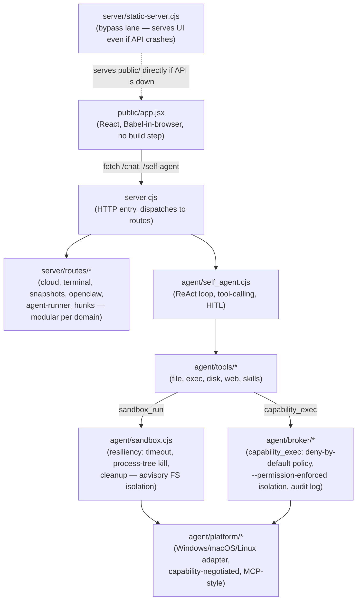

# ⚛️ WOLFSPACE

**A local, open-source AI coding chat that _proves_ its code by actually running it.**

Most AI coding tools hand you code and hope it works. WOLFSPACE treats the model as an
**untrusted guesser** and your **CPU as the judge**: generated code is executed and tested
automatically, and if it fails, the error is fed back to the model to fix — looping until it
genuinely runs.

> **model guesses → your CPU runs it → pass / fail (real)**

You don't get a smarter model. You get **output you can trust**, because it was proven by
execution, not by appearance.

---

## Why WOLFSPACE

- ✅ **Verified, not vibes.** Every code answer is run; you see real stdout/stderr and a
  `✓ verified` / `⚠ not passing` verdict — not "looks right."
- 🔌 **Any model.** Bring your own API key — WOLFSPACE auto-detects the provider
  (OpenAI, Claude, Qwen, DeepSeek, GitHub Models, Groq, OpenRouter, Gemini, or any
  OpenAI-compatible endpoint). Or run **local GGUF models** via llama.cpp.
- 🤗 **Model Hub.** Search Hugging Face, see real logos + download size, download a GGUF,
  and run it — all from the app.
- 🧪 **Compare models.** Send one prompt to two models side by side; both get auto-verified.
- ✏️ **Real editor.** Monaco (VS Code's editor) for every code block — edit in place, re-run,
  or ask the AI to revise.
- 🔒 **Local-first.** Runs on your machine, with your keys. Nothing leaves your computer
  except the model API calls you opt into.
- 🤖 **Self-editing agent.** WOLFSPACE ships an agent that can read, grep, and edit
  WOLFSPACE's *own* source under a snapshot → syntax-check → apply-or-rollback
  discipline — see [Resiliency](#resiliency) below.

---

## Quickstart

```bash
git clone https://github.com/<you>/WOLFSPACE && cd WOLFSPACE
npm start                      # -> http://127.0.0.1:8090
```

Open **http://127.0.0.1:8090**, click **⚛️ WOLFSPACE** (top-left) -> paste any **cloud API key**
-> ask for code. It runs and verifies automatically. That's it.

**Requirements:** [Node.js](https://nodejs.org) 18+ (or [Bun](https://bun.sh)).
Python is optional (only to execute Python snippets). No build step — the UI is served as-is.

### Optional: run models locally (offline, no API key)

Local models use [llama.cpp](https://github.com/ggml-org/llama.cpp). One-time setup downloads
`llama-server` + a small CPU-friendly model:

```powershell
powershell scripts/setup.ps1          # Windows: fetches llama.cpp + models
powershell scripts/start-models.ps1   # launch the local model servers
npm start
```

```bash
bash scripts/setup.sh                 # Linux/macOS
bash scripts/start-models.sh
npm start
```

Then pick a local model from the dropdown, or open the **Model Hub** to download more from
Hugging Face.

---

## Languages

Runs **Python** and **JavaScript** out of the box (JS via your Node/Bun runtime). WOLFSPACE also
runs **C, C++, Go, Java, PHP, Rust, and Kotlin** if their compilers are on your PATH — point to
them under `runners` in `config.json`. HTML/CSS preview live in an iframe.

## How it works

| Layer | Role |
|-------|------|
| **Generator** (untrusted) | guesses code — a local model via `llama-server`, or a cloud API |
| **Bridge** (`server.cjs` + `server/routes/*`) | streams tokens, extracts the code block, runs it, feeds errors back to retry |
| **Judge** (ground truth) | says what the code actually does — your CPU (subprocess) |

Configure everything in `config.json`: models/ports, local model dir, language runners.
Cloud keys are stored server-side in `~/.wolfspace/cloud-keys.json` — outside the project
tree, never in the browser, never committed.

## Architecture



Every arrow above was exercised by a real test during development, not just designed on
paper — see [Resiliency](#resiliency) and [Security](#security).

## Resiliency

The frontend and backend both assume any given edit — by the agent, by a bad model
completion, or by you — might be broken, and are built to survive that:

1. **Safe-edit** (`agent/safe-edit.cjs`) — every agent file write goes through
   snapshot → syntax-check → apply-or-quarantine. A syntactically broken write never
   reaches disk.
2. **Babel sandbox with auto-rollback** (`public/index.html`) — the UI compiles
   `app.jsx` in the browser; a compile error or an uncaught runtime error
   (`window.onerror`, `unhandledrejection`, and a React `ErrorBoundary` all feed the
   same path) reloads the last version that rendered successfully, with a 60s
   anti-loop guard.
3. **Server auto-rollback** (`start.cjs`) — if `server.cjs` crashes, it's restored
   from the last build that stayed up 10+ seconds, with exponential backoff on
   repeated crashes so a bad restore can't spin the CPU.
4. **Bypass lane** (`server/static-server.cjs`) — the frontend is served from a
   second, independent static process, so a full API crash still leaves the UI
   reachable while the API auto-restarts.

## Security

Code execution and file/network access in WOLFSPACE happen at **three different
trust levels** — know which one a given tool gives you:

| Layer | What it's for | What it actually enforces |
|---|---|---|
| **`sandbox_run`** (`agent/sandbox.cjs`) | Isolating crashes/hangs during normal dev use | Runs in a throwaway temp dir with a remapped home, a timeout that kills the *whole* process tree (`taskkill /F /T` / process-group kill), and auto-cleanup. On **Windows** (no `bwrap`), `readRoots`/`writeRoots`/`network` are **advisory only** — the spawned process has normal OS-level access. On **Linux with bubblewrap installed**, the platform adapter transparently wraps the command in `bwrap`, making isolation real (see below) — same tool, same options, stronger guarantee depending on what the OS can actually provide. |
| **`capability_exec`** (`agent/broker/*`) | Running code that must not read/write outside an explicit scope | Task code runs in a separate process launched with Node's `--permission` flag and **zero** filesystem grants. Its only way to affect anything is `await request(capability, params)`, checked by a deny-by-default `Policy` and logged to an audit trail. Verified against a real attack: the classic `vm`-escape payload (`this.constructor.constructor('return process')()`) still reaches a `process` object, but the subsequent `fs` call is denied by the runtime regardless of how it's reached. Does **not** cover network egress (no `--allow-net` exists yet in Node), worker threads, or native addons. |
| **Docker sandbox** (`sandbox/`, opt-in via `config.json`) | Hosting WOLFSPACE for people other than yourself | Real OS-level isolation — no network, capped CPU/RAM, read-only filesystem, hard timeout, via a throwaway container per execution. This is the only layer of the three with a genuine security boundary against a deliberately malicious payload. |

**Default posture:** WOLFSPACE runs generated and agent code **on your machine, with
your permissions**, like other local AI coding tools. Keep it bound to `127.0.0.1`;
**don't expose the server to a network** unless you've enabled the Docker sandbox.

### Linux: namespaces + cgroups (tested, not just designed)

`agent/platform/posix.cjs`'s `LinuxAdapter` wraps sandboxed commands in
[bubblewrap](https://github.com/containers/bubblewrap) (unprivileged Linux
namespaces — the same primitive Flatpak uses) instead of running them
unconfined. This was validated on a real WSL2 Linux kernel, as a **non-root
user**, against the same attack payloads used to test the Windows path:

| Test | Windows (Job Object, rejected — see project history) | Linux (bubblewrap + cgroup v2) |
|---|---|---|
| 300MB alloc vs. a 128MB memory cap | Not enforced — the allocation succeeded | `memory.max` + `memory.swap.max=0` → real kernel OOM kill (`SIGKILL`, `memory.events` showed `oom_kill: 1`) |
| Outbound HTTP to a non-allowlisted host | Not covered by `capability_exec` (no `--allow-net` in Node) | `--unshare-net` → `ECONNRESET`, no interface exists in the namespace |
| Reading a file outside the granted scope | `ERR_ACCESS_DENIED` (file visible, access refused) | `ENOENT` — the file isn't mounted, so it doesn't exist from the process's point of view |

**Two honest caveats:**
- Namespace isolation (`fsIsolation`/`networkIsolation`) works unprivileged and is
  used automatically whenever `bwrap` is on `PATH` — `capabilities()` probes for
  it at runtime rather than assuming.
- The memory-cap path (`wrapWithMemoryLimit`, via `systemd-run --user --scope`)
  needs cgroup v2 delegation, which systemd-based user sessions get automatically
  but a bare container/init does not — confirmed by testing: a non-root user got
  `EACCES` trying to create its own cgroup directly. `capabilities().resourceLimits`
  reflects whether `systemd-run` was actually found, not whether Linux
  theoretically supports it.

## Roadmap

- OS-level enforced isolation for `capability_exec` specifically (it currently
  uses Node's `--permission` flag, not the platform adapter's bwrap wrapping —
  wiring these together is the next step)
- Windows AppContainer / restricted-token isolation (Job Object was tried and
  rejected — see project history — it doesn't reliably bind Node's memory use)
- macOS Seatbelt (`sandbox-exec`) — `MacAdapter` shares `PosixAdapter`'s
  advisory-only behavior today, unverified on real macOS hardware
- MCP tool connections (filesystem, web, etc.)
- Richer verification (tests-as-spec, coverage)

## License

MIT — see [LICENSE](LICENSE).

