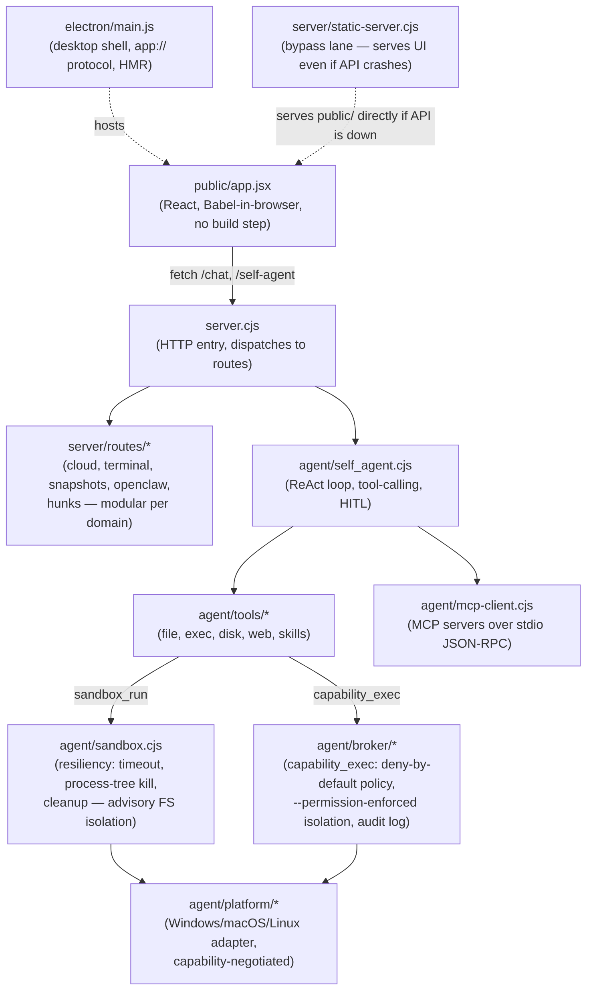

# 🐺 WOLFSPACE

**A local, open-source AI coding workspace that _proves_ its code by actually running it.**

Most AI coding tools hand you code and hope it works. WOLFSPACE treats the model as an
**untrusted guesser** and your **CPU as the judge**: generated code is executed and tested
automatically, and if it fails, the error is fed back to the model to fix — looping until it
genuinely runs.

> **model guesses → your CPU runs it → pass / fail (real)**

You don't get a smarter model. You get **output you can trust**, because it was proven by
execution, not by appearance.

---

## Features

- ✅ **Verified, not vibes.** Every code answer is run; you see its real stdout/stderr and a
  pass/fail indicator — not "looks right." The agent cannot even declare itself done
  without a successful execution to point at.
- 🔌 **Any model.** Bring your own API key — the provider is auto-detected from the key
  (OpenAI, Claude, Gemini, Groq, OpenRouter, GitHub Models, NVIDIA, DeepSeek, Qwen,
  OpenCode, or any OpenAI-compatible endpoint). Or run **local GGUF models** via llama.cpp —
  a running local model is auto-detected and used on startup.
- ✏️ **Real editor.** Monaco (VS Code's editor) for every code block — edit in place, re-run,
  or ask the AI to revise.
- 🔗 **MCP tools.** Connect Model Context Protocol servers (Notion, GitHub, filesystem, …);
  their tools become callable by the agent, with live per-server connection status.
- 🕸️ **Logic canvas.** A React Flow node graph for composing multi-step workflows from
  Trigger, HTTP Request, Transform, Condition, and Output nodes, wired together visually.
- 🔒 **Local-first.** Runs on your machine, with your keys. Nothing leaves your computer
  except the model API calls you opt into.
- 🤖 **Self-editing agent.** WOLFSPACE ships an agent that can read, grep, and edit
  WOLFSPACE's _own_ source under a snapshot → syntax-check → apply-or-rollback discipline.

---

## Quickstart

### From source

```bash
git clone https://github.com/tegardave-alt/Wolfspace-ai-native
cd Wolfspace-ai-native
npm install
npm start                      # -> http://127.0.0.1:8090
```

Open **http://127.0.0.1:8090**, paste any **cloud API key** in settings, then ask for code.
It runs and verifies automatically.

**Requirements:** [Node.js](https://nodejs.org) 18+ (or [Bun](https://bun.sh)).
Python is optional (only to execute Python snippets). No build step — the UI is served as-is.

### As a desktop app

The same core wrapped in an Electron shell, with hot-reload during development:

```bash
npm run app                    # launch the desktop shell
npm run dist                   # build a Windows NSIS installer
```

The installer is **not code-signed**, so Windows SmartScreen will warn on first run —
choose _More info → Run anyway_.

### With Docker

Runs the server + agent in a container; the UI is served over HTTP rather than in a
native window. Note this image runs Node and Python only — Go/Java/Rust/PHP/C toolchains
are not installed, and `config.docker.json` leaves those runners unset.

```bash
docker build -t wolfspace .
docker run -p 8090:8090 -v wolfspace-data:/data wolfspace
```

### Optional: run models locally (offline, no API key)

Local models use [llama.cpp](https://github.com/ggml-org/llama.cpp). One-time setup downloads
`llama-server` + a small CPU-friendly model:

```powershell
powershell scripts/setup.ps1          # Windows: fetches llama.cpp + models
powershell scripts/start-models.ps1   # launch the local model servers
npm start
```

```bash
bash scripts/setup.sh                 # Linux/macOS
bash scripts/start-models.sh
npm start
```

The running local model is picked up automatically on startup — there is currently no
in-app switcher to change between multiple local or cloud models; it's whichever one
`/models` reports first, or your configured cloud key if you have one set.

---

## Languages

Runs **Python** and **JavaScript** out of the box (JS via your Node/Bun runtime). WOLFSPACE also
runs **C, C++, Go, Java, PHP, Rust, and Kotlin** if their compilers are on your PATH — point to
them under `runners` in `config.json`. HTML/CSS preview live in an iframe.

## How it works

| Layer                                         | Role                                                                         |
| --------------------------------------------- | ---------------------------------------------------------------------------- |
| **Generator** (untrusted)                     | guesses code — a local model via `llama-server`, or a cloud API              |
| **Bridge** (`server.cjs` + `server/routes/*`) | streams tokens, extracts the code block, runs it, feeds errors back to retry |
| **Judge** (ground truth)                      | says what the code actually does — your CPU (subprocess)                     |

Configure everything in `config.json`: models/ports, local model dir, language runners.
Cloud keys are stored server-side in `~/.wolfspace/cloud-keys.json` — outside the project
tree, never in the browser, never committed. MCP servers live in `config/mcp.json`
(see `config/mcp.example.json`), which is likewise untracked.

## Architecture



Both the desktop shell and the Docker image run the same core — Electron hosts the UI in a
native window, the container serves it over HTTP.

## Security

WOLFSPACE runs generated and agent code **on your machine, with your permissions**, like
other local AI coding tools. Keep it bound to `127.0.0.1`; **don't expose the server to a
network** unless you've enabled the Docker sandbox.

Code execution happens at three trust levels — `sandbox_run` (crash isolation, advisory
filesystem limits on Windows), `capability_exec` (deny-by-default broker enforced by Node's
`--permission` flag), and the Docker sandbox (the only layer with a real boundary against a
hostile payload).

Every layer's guarantees, its **limits**, and the escape tests it was measured against are
documented in **[docs/SECURITY.md](docs/SECURITY.md)** — along with the four-layer
auto-rollback design that lets the app survive a broken edit to its own source.

## Development

```bash
npm test                       # jest
npm run dev                    # nodemon
npm run start:bypass           # with the auto-rollback supervisor
```

CI runs three jobs on every push: tests, a Windows Electron build (verifying the packaged
output actually loads), and a Docker build (asserting the sandbox image executes code as a
non-root user).

## Roadmap

- OS-level enforced isolation for `capability_exec` specifically (it currently
  uses Node's `--permission` flag, not the platform adapter's bwrap wrapping)
- Windows AppContainer / restricted-token isolation
- macOS Seatbelt (`sandbox-exec`) — `MacAdapter` is advisory-only today, unverified on
  real macOS hardware
- Code-signed installers (currently unsigned; SmartScreen warns on first run)
- Richer verification (tests-as-spec, coverage)

## License

MIT — see [LICENSE](LICENSE).
