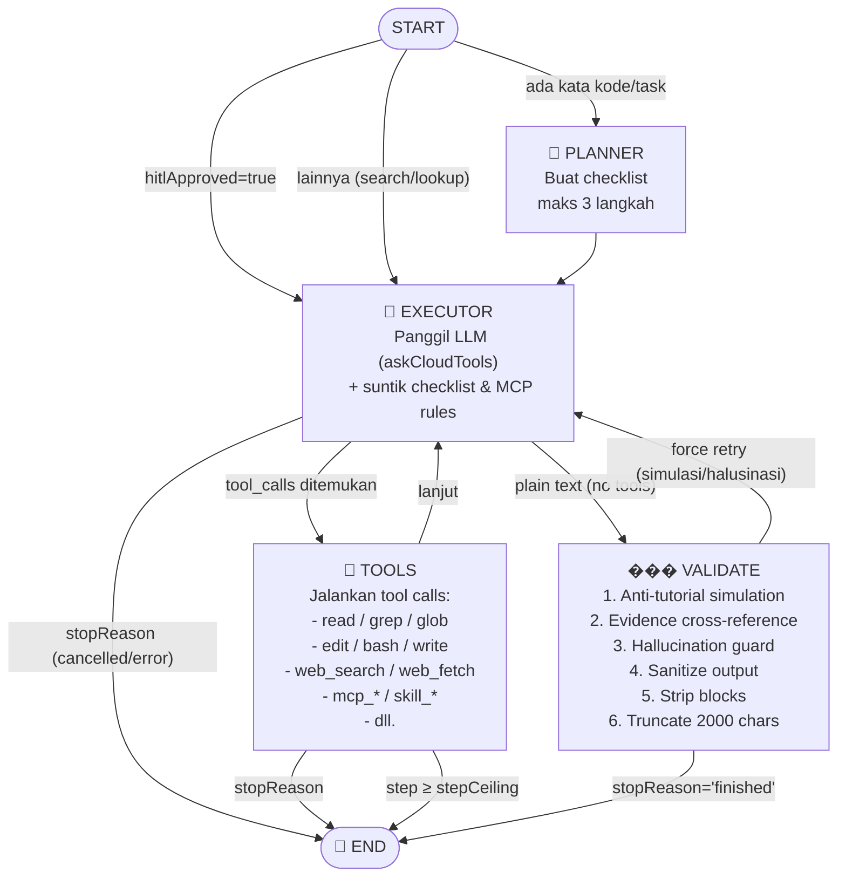

# Diagram Alur Agent LangGraph

# Diagram Alur Agent (LangGraph)

## Penjelasan Alur

1. **START** → conditional router: jika ada HITL pending langsung ke executor; jika task membutuhkan kode/eksekusi, masuk planner; selain itu langsung executor.
2. **Planner** → membuat _checklist 3 langkah_ singkat sebagai panduan, lalu lanjut ke executor.
3. **Executor** → memanggil LLM dengan seluruh riwayat pesan + checklist aktif + aturan tools. LLM bisa membalas dengan **tool_calls** (lanjut ke tools) atau **jawaban teks** (lanjut ke validate).
4. **Tools** → mengeksekusi semua tool call yang diminta LLM. Hasilnya dikembalikan sebagai `tool` messages. Jika jumlah langkah melebihi `stepCeiling`, graph berhenti (dapat di-resume nanti).
5. **Validate** → filter multi-tahap: deteksi simulasi/tutorial palsu, cross-reference klaim terhadap bukti tool nyata, guard halusinasi, strip blok `<think>`, dan potong prosa ke 2000 karakter. (Sanitasi kata spekulatif sudah **dihapus**: ia menyisipkan penanda `[kata-spekulatif-dihapus]` ke tengah kalimat yang tampil ke user, dan menghapus katanya saja akan mengubah dugaan jadi pernyataan pasti.) Jika lolos → **END**; jika ada masalah → **force retry** (executor dipanggil ulang dengan peringatan).

**Loop utama:** `executor → tools → executor → tools → ... → validate → (END atau executor)`
