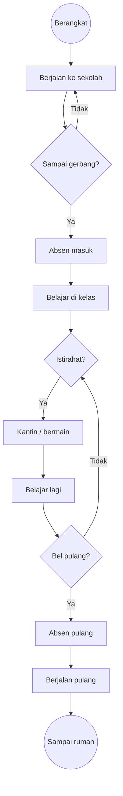

# Diagram Alur Siswa Sekolah

```mermaid
flowchart TD
    A((Berangkat)) --> B[Berjalan ke sekolah]
    B --> C{Sampai gerbang?}
    C -->|Ya| D[Absen masuk]
    D --> E[Belajar di kelas]
    E --> F{Istirahat?}
    F -->|Ya| G[Kantin / bermain]
    G --> H[Belajar lagi]
    H --> I{Bel pulang?}
    I -->|Ya| J[Absen pulang]
    J --> K[Berjalan pulang]
    K --> L((Sampai rumah))
    I -->|Tidak| F
    C -->|Tidak| B
```
