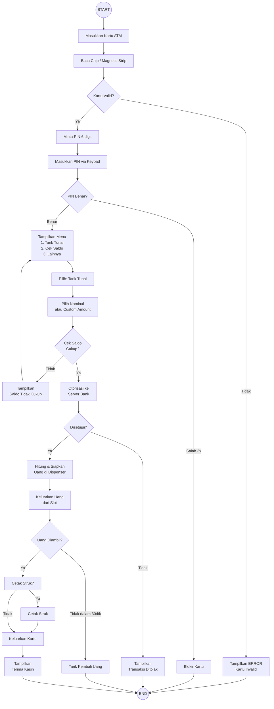

# Diagram ATM Penarikan

## Komponen Fisik ATM

| Komponen             | Fungsi                         |
| -------------------- | ------------------------------ |
| **Card Reader**      | Membaca data kartu ATM         |
| **Keypad / PIN Pad** | Input PIN & pilihan menu       |
| **Display Screen**   | Menampilkan instruksi & status |
| **Cash Dispenser**   | Mengeluarkan lembaran uang     |
| **Receipt Printer**  | Mencetak struk transaksi       |
| **Safe Cassette**    | Menyimpan stok uang            |
| **CPU / Controller** | Logika transaksi               |
| **Modem / GSM**      | Koneksi ke server bank         |
