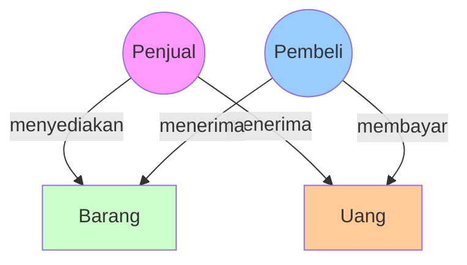

# Diagram Sistem Pasar Tradisional

```mermaid
flowchart TD
    P((Penjual)) -->|menyediakan| B[Barang]
    P -->|menerima| U[Uang]
    PB((Pembeli)) -->|membayar| U
    PB -->|menerima| B
    style P fill:#f9f;
    style PB fill:#9cf;
    style B fill:#cfc;
    style U fill:#fc9;
```
