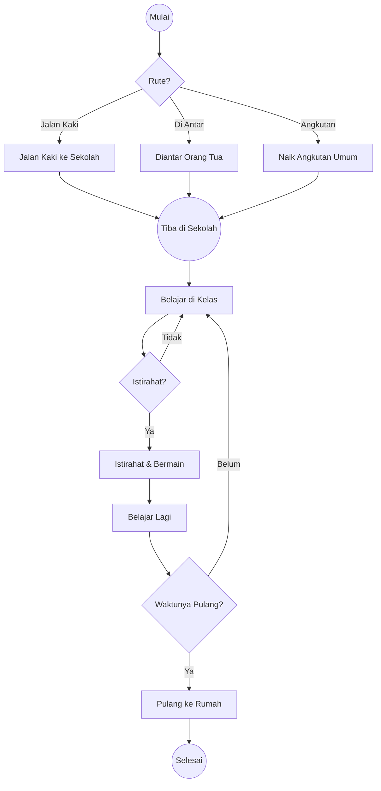

# Diagram Sistem Sekolahan — Berangkat sampai Pulang

```mermaid
flowchart TD
    A((Mulai)) --> B{Rute?}
    B -->|Jalan Kaki| C[Jalan Kaki ke Sekolah]
    B -->|Di Antar| D[Diantar Orang Tua]
    B -->|Angkutan| E[ Naik Angkutan Umum ]
    C --> F(( Tiba di Sekolah ))
    D --> F
    E --> F
    F --> G[ Belajar di Kelas ]
    G --> H{ Istirahat? }
    H -->|Ya| I[ Istirahat & Bermain ]
    H -->|Tidak| G
    I --> J[ Belajar Lagi ]
    J --> K{ Waktunya Pulang? }
    K -->|Belum| G
    K -->|Ya| L[ Pulang ke Rumah ]
    L --> M(( Selesai ))
```
