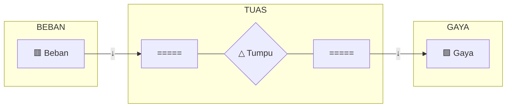

# Diagram Sistem Leverage

```mermaid
flowchart LR
    subgraph BEBAN
        L[🟥 Beban]
    end
    subgraph TUAS
        A[=====]
        F{△ Tumpu}
        B[=====]
    end
    subgraph GAYA
        E[🟩 Gaya]
    end

    L -->|"↓"| A
    A --- F
    F --- B
    B -->|"↓"| E
```
