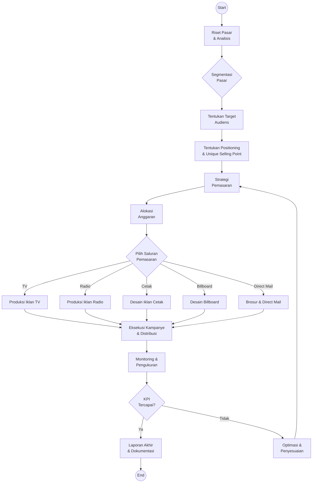

# Workflow Sistem Pemasaran Tradisional

# Workflow Sistem Pemasaran Tradisional



```wolfspace-workflow
{
  "nodes": [
    { "id": "n1", "kind": "prompt", "label": "Riset Pasar & Analisis" },
    { "id": "n2", "kind": "condition", "label": "Segmentasi Pasar" },
    { "id": "n3", "kind": "prompt", "label": "Tentukan Target Audiens" },
    { "id": "n4", "kind": "prompt", "label": "Positioning & USP" },
    { "id": "n5", "kind": "agent", "label": "Strategi Pemasaran" },
    { "id": "n6", "kind": "tool", "label": "Alokasi Anggaran" },
    { "id": "n7", "kind": "condition", "label": "Pilih Saluran Pemasaran" },
    { "id": "n8", "kind": "tool", "label": "Produksi Materi Iklan" },
    { "id": "n9", "kind": "agent", "label": "Eksekusi Kampanye" },
    { "id": "n10", "kind": "tool", "label": "Monitoring & Pengukuran" },
    { "id": "n11", "kind": "condition", "label": "KPI Tercapai?" },
    { "id": "n12", "kind": "output", "label": "Optimasi & Penyesuaian" },
    { "id": "n13", "kind": "output", "label": "Laporan Akhir" }
  ],
  "edges": [
    { "from": "n1", "to": "n2" },
    { "from": "n2", "to": "n3" },
    { "from": "n3", "to": "n4" },
    { "from": "n4", "to": "n5" },
    { "from": "n5", "to": "n6" },
    { "from": "n6", "to": "n7" },
    { "from": "n7", "to": "n8" },
    { "from": "n8", "to": "n9" },
    { "from": "n9", "to": "n10" },
    { "from": "n10", "to": "n11" },
    { "from": "n11", "to": "n12", "label": "Tidak" },
    { "from": "n11", "to": "n13", "label": "Ya" },
    { "from": "n12", "to": "n5" }
  ]
}
```
