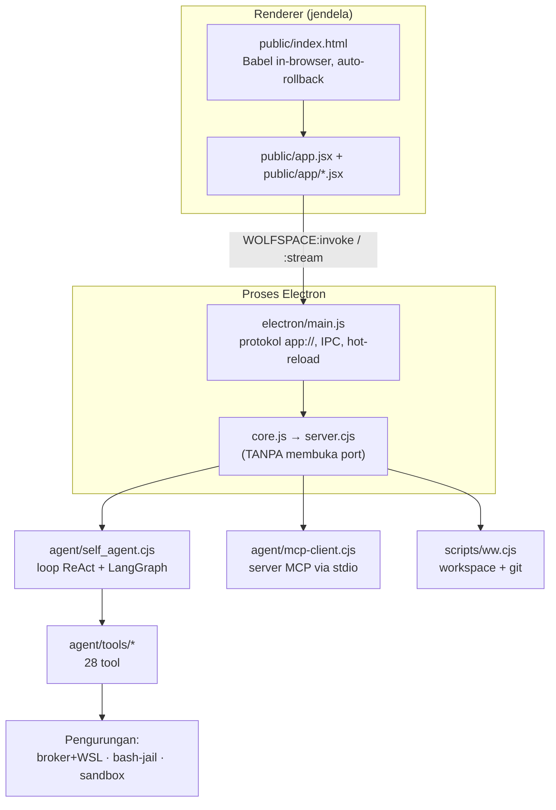

# Peta WOLFSPACE

Dokumen ini memetakan seluruh sistem: apa yang berjalan di mana, apa yang
memanggil apa, dan **di mana batas jaminannya**. Angka dan nama di sini diambil
langsung dari repo, bukan dari ingatan.

> Untuk rincian keamanan per-lapis beserta batasnya, lihat
> [SECURITY.md](SECURITY.md). Untuk broker/zona, lihat
> [`agent/broker/README.md`](../agent/broker/README.md).

---

## 1. Cara menjalankannya

| Perintah          | Yang terjadi                                                    |
| ----------------- | --------------------------------------------------------------- |
| `npm start`       | `server.cjs` sebagai proses utama → HTTP di `127.0.0.1:8090`    |
| `npm run app`     | Electron. UI lewat `app://`, backend **dalam proses yang sama** |
| `npm run app:wsl` | Sama, tapi seluruh backend dijalankan di dalam WSL              |
| `npm test`        | Jest, 18 suite                                                  |
| `npm run dist`    | Installer Windows (electron-builder)                            |

> **Di PowerShell**, pakai `node scripts/…` atau `npm.cmd run …`.
> PowerShell memilih `npm.ps1` sebelum `npm.cmd`, dan kebijakan bawaan
> (`Restricted`) memblokir `.ps1`.

**Dua mode, dua jalur berbeda.** `npm start` benar-benar membuka port.
`npm run app` **tidak** — `core.js` hanya me-`require` `server.cjs`, dan
`server.cjs` hanya memanggil `listen()` bila ia modul utama. Di Electron,
renderer bicara lewat IPC, bukan HTTP. Ini sering menyesatkan saat menelusuri
masalah: `curl` ke 8090 tak menjawab apa pun padahal aplikasinya jalan normal.

---

## 2. Peta proses



---

## 3. Lapisan UI

`public/index.html` mengambil tiap modul, mentranspilnya dengan Babel di
browser, lalu **menyuntikkan semuanya sebagai SATU `<script>`** — jadi seluruh
modul berbagi satu scope global dan deklarasi fungsi ter-hoist lintas berkas.

Urutan muat (`APP_MODULES`) — urutannya penting saat sebuah modul dipakai modul
lain:

```
Config.jsx → Viewport.jsx → Icons.jsx → Model3DViewer.jsx → VisualTools.jsx
→ CodeBlocks.jsx → Views.jsx → Components.jsx → Screens.jsx → Sidebar.jsx
→ AgentSteps.jsx → usePreviewPanel.jsx → Workflow.jsx → app.jsx
```

**Dua jaring pengaman di UI, dan keduanya bisa memuat ulang halaman:**

| Pemicu                                      | Akibat                                                                                                                    |
| ------------------------------------------- | ------------------------------------------------------------------------------------------------------------------------- |
| Error JS tak tertangkap                     | `window.location.replace("/?rollback=true")` — kembali ke UI awal, penyebabnya dicetak sebagai `💥 RUNTIME ERROR RECORD…` |
| Perubahan `public/**` bukan `.css/.jsx/.js` | `window.location.reload()`                                                                                                |

Kalau aplikasi "tiba-tiba kembali ke awal", satu di antara dua baris itu ada di
Console — dan mana yang muncul menentukan diagnosisnya.

---

## 4. Satu langkah agent, dari klik sampai disk

```
UI (app.jsx)
  └─ streamSelfAgent(payload) ──IPC "WOLFSPACE:stream"──►  electron/main.js
                                                              └─ core().selfAgentStream
                                                                   │
                     agent/self_agent.cjs (LangGraph StateGraph)   │
                       ├─ state di-checkpoint ke MemorySaver (globalThis)
                       ├─ task_checklist disuntik ulang TIAP langkah
                       └─ panggil tool ──► agent/tools/index.cjs (runSelfTool)
                                              ├─ gerbang kualitas + safe-edit
                                              └─ pengurungan (bagian 5)
```

**Kenapa `MemorySaver` di `globalThis`.** Backend memuat ulang modul (hot-reload
dan per-permintaan), yang membuat ulang semua state tingkat-modul. Kalau
checkpointer ikut dibuat ulang, run yang dijeda HITL kehilangan checkpoint-nya
dan resume tak menemukan apa pun. `globalThis` membuatnya bertahan.

**Verdict eksekusi membawa CAKUPAN-nya.** Loop anti-halu menolak DONE tanpa satu
eksekusi `ok=true`. Tapi `ok=true` sendiri hanya berarti "proses keluar 0" — maka
setiap verdict kini membawa `kurungan` (root + `enforced` + mekanisme), dan
gerbang DONE menyatakannya: _"terkurung ke X"_ bila ditegakkan, atau _"cakupan
advisory"_ bila tidak. Di Windows ini **attestation, bukan penegakan** — tak ada
namespace. Eksekusi verifikasi juga tak lagi mewarisi `process.env` utuh (env
terbatas + `TEMP` diarahkan ke workspace). **Belum tercakup:** `runByLang`
(auto-run `/chat` untuk C/Go/Java/dll) — jalur runner terpisah, bukan penggerbang
DONE.

**`thread_id` adalah kunci ingatan.** Bila permintaan datang tanpa `thread_id`,
`self_agent.cjs` mencetak yang baru — dan agent mulai dari nol. Karena itu UI
menyimpannya di `localStorage` (kedaluwarsa 30 menit, dihapus saat run tuntas),
supaya reload dari sumber mana pun tak membuat agent lupa dan mengulang kerja.

---

## 5. Tiga tingkat pengurungan — dan batasnya

Ketiganya BUKAN hal yang sama. Salah menyamakannya menghasilkan kesimpulan yang
salah tentang "apakah sandbox-nya bekerja".

| Tool              | Mekanisme                                                       | Yang benar-benar dijamin                                                                 |
| ----------------- | --------------------------------------------------------------- | ---------------------------------------------------------------------------------------- |
| `sandbox_run`     | direktori temp + timeout + kill pohon proses                    | isolasi **kerusakan**, bukan keamanan. `readRoots`/`network` di Windows bersifat anjuran |
| `capability_exec` | proses terpisah + flag permission Node + `unshare -n` lewat WSL | berkas ditolak di lapisan binding; jaringan hanya lewat `request()` yang di-audit        |
| `bash`            | `bash-jail.cjs`: mount/net/pid namespace + chroot + ulimit      | batas nyata — **hanya di Linux**. Di Windows jatuh ke penjaga regex                      |

### Zona kapabilitas (`capability_exec`) secara rinci

```
┌─ PROSES WINDOWS ────────────────────────────────┐
│  Broker + Policy + jejak audit                  │
│  KUNCI API tetap di sini, tak pernah menyeberang│
│      │ spawn wsl.exe -d <distro> --             │
│      │   unshare -n <node> --permission <worker>│
└──────┼──────────────────────────────────────────┘
       │ stdin/stdout — pipa, BUKAN jaringan,
       │ jadi selamat di dalam network namespace
╔══════▼══════════════════════════════════════════╗
║ KERNEL LINUX — namespace jaringan KOSONG        ║
║   node --permission (nol grant fs)              ║
║     └─ zone-worker.cjs → vm menjalankan tugas   ║
║          request(...) = satu-satunya pintu      ║
╚═════════════════════════════════════════════════╝
```

Tiga transport dipilih otomatis: `unshare -n` langsung (Linux) → `wsl.exe`
(Windows) → `fork` biasa (sisanya, **tanpa** pengurungan jaringan). Jalur ketiga
kini berteriak sekali ke stderr dan menempelkan `[TANPA PENGURUNGAN JARINGAN]`
ke keluaran yang dibaca model — dulu ia diam.

**Flag permission berbeda menurut versi Node**: `--permission` untuk ≥ 23,
`--experimental-permission` (+ `--allow-fs-read` untuk skrip masuknya sendiri)
untuk 20–22, dan **ditolak** di bawah 20. Batas Node sebenarnya **20**, bukan 18
seperti tertulis di `package.json`.

### Yang TIDAK dijamin

- Zona tak punya batas memori/CPU sendiri. Yang membatasi adalah `.wslconfig`
  (mis. `memory=2GB`) — **per-VM, bukan per-zona**. Terbukti mengikat: zona yang
  minta 3,5 GB mati kena OOM killer (`exit 9`).
- `unshare -n` tak bisa dibuktikan di mesin yang distronya memang tak berjaringan
  (`networkingMode=none` di `.wslconfig` berlaku **se-mesin**, bukan per-distro).
  Hasilnya sama-sama "tak ada jaringan", tapi bukan hal yang sama.
- ~~Jejak audit broker hanya di memori~~ — sekarang juga di-append ke
  `.wolfspace/audit/broker.jsonl`, satu baris JSON per catatan, dirotasi di 2 MB.
  **Muatannya sengaja tak ikut**: isi berkas dipotong 200 karakter (panjang
  aslinya tetap dicatat) dan field bernama `key`/`token`/`auth`/dsb disunting —
  audit mencatat APA yang diakses, bukan datanya. Gagal menulis tak melumpuhkan
  agent tapi berteriak sekali ke stderr. `append-only` di sini berarti berkasnya
  hanya pernah di-append, **bukan** kekal: proses ber-izin tulis tetap bisa
  memotongnya. Kekekalan sungguhan menuntut dukungan OS yang tak bisa diandalkan
  lintas platform.

---

## 6. Workspace (`ww`)

Tiap folder di bawah root `ww` adalah **repo git independen** dengan branch
sendiri — bukan worktree yang berbagi riwayat.

Endpoint: `/ww/list`, `/ww/attach`, `/ww/tree`, `/ww/git`, `/ww/branches`,
`/ww/branch/{switch,create,rename,delete}`, `/ww/commit`, `/ww/rename`,
`/ww/delete`, `/ww/verify`, `/ww/ls-{save,load}`.

Panelnya ada di menu folder pada sidebar (`WorkspaceGitPanel` di
`public/app/Sidebar.jsx`). Tombol **Commit** muncul di baris status, dan **hanya
bila ada perubahan**. Ia mementaskan seluruh working tree (`add -A`, termasuk
penghapusan) supaya sepadan dengan angka "N uncommitted changes" di sebelahnya.
Commit tanpa pesan sengaja tak disediakan.

---

## 7. Gerbang yang menjaga agent dari dirinya sendiri

| Gerbang                  | Berkas                                           | Yang dicegah                                                                                         |
| ------------------------ | ------------------------------------------------ | ---------------------------------------------------------------------------------------------------- |
| Ratchet kualitas         | `agent/code-quality.cjs`                         | edit yang **memperdalam** sarang atau memanjangkan berkas. Berkas baru: maks indentasi 24, 800 baris |
| Safe-edit                | `agent/safe-edit.cjs`                            | tulisan yang rusak sintaksnya — snapshot → cek → terapkan/karantina                                  |
| Penjaga tulis-lewat-bash | `_BASH_CODE_WRITE_RE` di `agent/tools/index.cjs` | `echo > x.jsx`, `tee`, `python open(w)` yang melewati kedua gerbang di atas                          |
| Policy broker            | `agent/broker/policy.cjs`                        | akses berkas/jaringan di luar cakupan workspace aktif                                                |

Cakupan `capability_exec` mengikuti `context.workspaceRoot` → `WW_WORKSPACE_ROOT`
→ global, urutan yang sama dengan tool lain di berkas itu.

---

## 8. Hot-reload — dan jebakannya

`electron/main.js` memantau `public`, `electron`, `agent`, `scripts`, plus
berkas backend di akar. Itu **persis** direktori yang disunting agent
penyunting-diri, jadi agent bisa memicu reload-nya sendiri.

Karena itu ada penjaga: selama ada run agent hidup, reload **ditunda** (bukan
dibatalkan), lalu dijalankan setelah run terakhir selesai.

> **Jebakan yang sudah pernah terjadi.** Penjaga itu bergantung pada `finish()`
> yang selalu dipanggil. Sekali terlewat, entri stream tertinggal selamanya dan
> **setiap** reload ditunda tanpa batas — aplikasi berhenti memperbarui diri
> tanpa satu pun pesan. Kini `finish()` dijamin `try/catch`, dan
> kebergantungannya dibatasi 15 menit sebagai jaring kedua.

Berkas baru **tidak** memicu reload (hanya perubahan isi dari baseline yang
dikenal), supaya event palsu Windows tak menyebabkan reload hantu.

---

## 9. Uji dan CI

18 suite, ~135 uji. Yang khas dari repo ini: banyak uji memeriksa **struktur
kode**, bukan cuma perilaku — karena kode platform (Electron, WSL, namespace)
tak bisa dimuat di Jest, dan penjaganya harus tetap ada.

Pola yang dipegang: **uji pengurungan wajib memeriksa garis dasarnya lebih
dulu.** Uji yang lulus karena keadaan kebetulan menguntungkan (DNS mati, distro
tak berjaringan) tidak membuktikan apa pun — kesalahan ini sudah terjadi dua kali
dan sekarang dijaga eksplisit.

CI (`.github/workflows/ci.yml`) menjalankan dua job: **Test & syntax**
(ubuntu) dan **Build Electron** (windows, memverifikasi isi paket dan rantai
`require` dari hasil build). Alasannya tertulis di berkas itu: _fitur yang tak
pernah dieksekusi = rusak diam-diam_. Job **Build image Docker** dihapus
bersama berkas Docker-nya.

---

## 10. Peta berkas

| Berkas                   | Baris | Peran                                 |
| ------------------------ | ----: | ------------------------------------- |
| `server.cjs`             |  5493 | seluruh handler HTTP + logika backend |
| `public/app.jsx`         |  3593 | komponen utama UI                     |
| `agent/self_agent.cjs`   |  2511 | loop agent, LangGraph, HITL           |
| `public/app/Sidebar.jsx` |  2347 | sidebar, panel workspace + git        |
| `agent/tools/index.cjs`  |  1737 | dispatcher tool + gerbang             |
| `electron/main.js`       |  1006 | shell, IPC, protokol, hot-reload      |
| `scripts/ww.cjs`         |   532 | manajer workspace + operasi git       |
| `public/index.html`      |   384 | pemuat modul, Babel, auto-rollback    |

Direktori: `public/` 183 berkas · `agent/` 47 · `scripts/` 25 · `tests/` 24.

**28 tool agent:** `architecture_map` `bash` `capability_exec` `dspy` `edit`
`generate_3d` `glob` `grep` `list` `opencode_run` `question` `read`
`replace_file_content` `retrieve` `sandbox_run` `skill_install` `skill_list`
`skill_run` `task` `terminal_close` `terminal_open` `terminal_read`
`terminal_write` `todowrite` `web_fetch` `web_search` `write` `write_artifact`

---

## 11. Celah yang diketahui, belum ditutup

Daftar ini sengaja ada supaya tak ada yang mengira sudah beres.

1. ~~**Jejak audit broker tidak bertahan.**~~ **Ditutup** — lihat bagian 5.
   Catatan kini di-append ke `.wolfspace/audit/broker.jsonl`. Yang belum:
   kekekalan sungguhan (proses ber-izin tulis masih bisa memotong berkasnya).
2. **`engines` berbohong.** `package.json` menjanjikan `>=18`; batas sebenarnya 20.
3. **`bash` tak terkurung di Windows.** `bash-jail` hanya Linux; di Windows
   penjaga regex yang kodenya sendiri melabeli "bocor".
4. **Zona tanpa batas sumber daya sendiri.** Hanya batas VM dari `.wslconfig`.
5. **`conhost.exe` bocor satu per sesi terminal.** Anak dari proses server, bukan
   anak shell, jadi `taskkill /T` tak menjangkaunya; node-pty tak mengekspos
   pid-nya. Hilang saat aplikasi ditutup.
6. **Penangan `uncaughtException` menelan pesan asli.** Kegagalan muat modul
   muncul sebagai `exit 7` tanpa `MODULE_NOT_FOUND` — sudah pernah membuat CI
   merah tanpa petunjuk.
7. **Riwayat chat dirender utuh.** Tanpa jendela, tanpa batas jumlah pesan.
   Beban editor sudah dibatasi ke yang terlihat, tapi jumlah node DOM belum.
8. **Model lokal tak terhubung.** Skrip llama.cpp masih ada, tapi tak ada
   pemanggil `askModelStream()`; kunci cloud wajib.

---

## 12. Prinsip yang dipakai berulang

Tiga hal ini muncul di hampir semua keputusan di atas, dan menjelaskan kenapa
kodenya berbentuk seperti ini:

**Ground truth, bukan laporan.** Model menebak, CPU menghakimi. Pola yang sama
diterapkan ke agent (`todowrite` disuntik ulang tiap langkah) dan ke pengujian
(ukur dulu, baru nyatakan).

**Kegagalan harus terlihat.** Pengaman yang bisa mati sendiri tanpa memberi tahu
lebih berbahaya daripada tak ada pengaman — orang berhenti memeriksa. Karena itu
zona tanpa pengurungan berteriak, dan probe WSL menyimpan **sebab** kegagalannya,
bukan cuma faktanya.

**Aturan ditegakkan di kode, bukan di prompt.** Gerbang kualitas, safe-edit, dan
policy broker semuanya berjalan di jalur eksekusi nyata — bukan sebagai instruksi
yang bisa diabaikan model.
